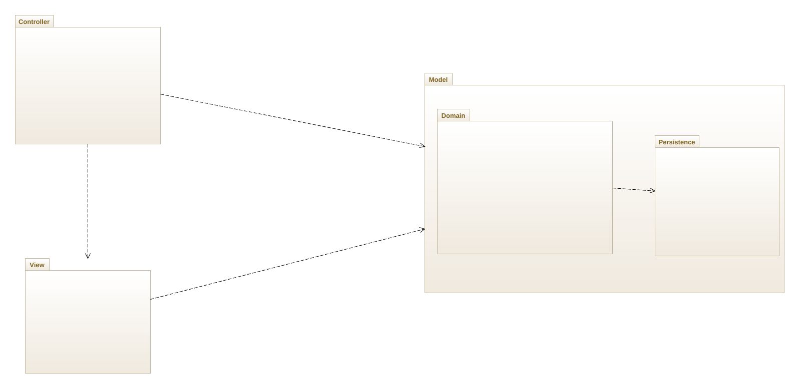
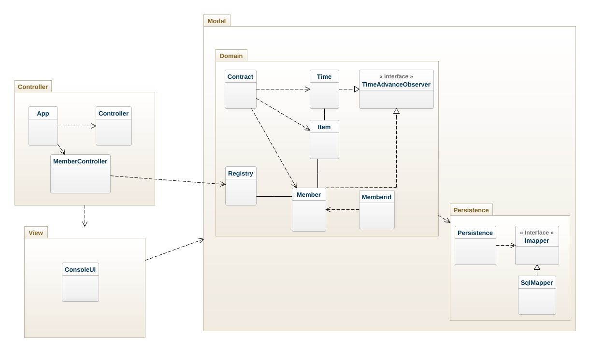
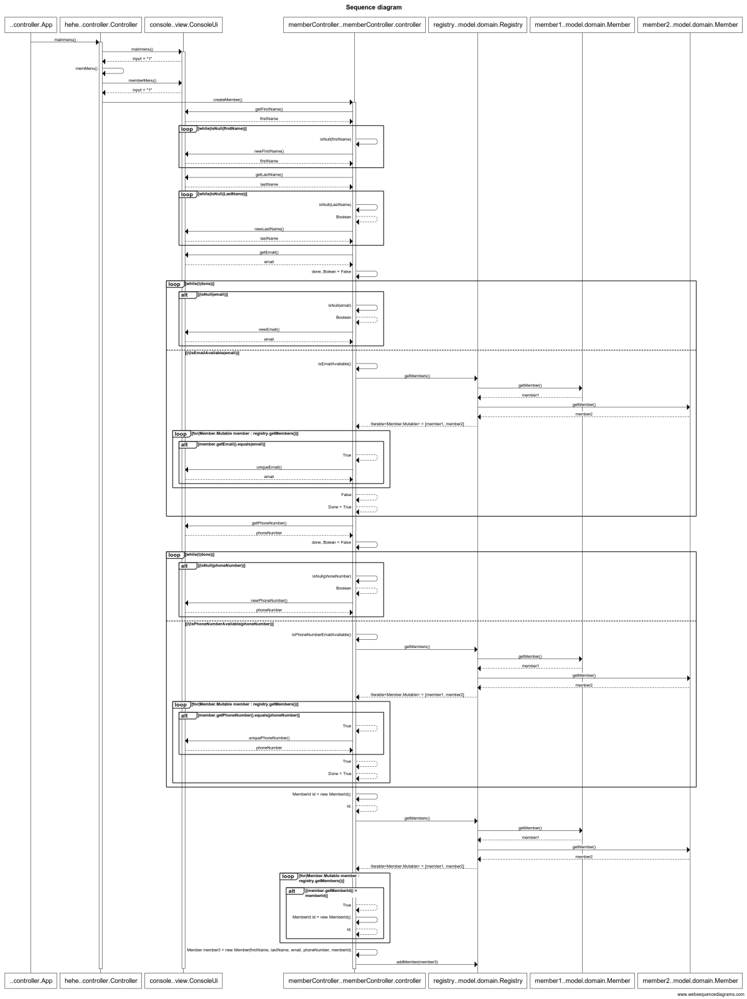

# Stuff Lending System.

## Architectural Overview
The application uses the model-view-controller (MVC) architectural pattern. The view is passive and gets called from the controller. The view may only read information from the model, not directly change it.



## Detailed Design

### Class Diagram


### Object Diagram


### Sequence Diagram


```
title Sequence diagram

..controller.App ->+hehe..controller.Controller: mainmenu()
hehe..controller.Controller->+console..view.ConsoleUi: mainmenu()
console..view.ConsoleUi-->hehe..controller.Controller: input = "1"
hehe..controller.Controller->hehe..controller.Controller: memMenu()
hehe..controller.Controller->console..view.ConsoleUi: memberMenu()
console..view.ConsoleUi-->hehe..controller.Controller: input = "1"
hehe..controller.Controller->+memberController..memberController.controller: createMember()
memberController..memberController.controller->console..view.ConsoleUi: getFirstName()
console..view.ConsoleUi-->memberController..memberController.controller: firstName

loop while(isNull(firstName))
    memberController..memberController.controller -> memberController..memberController.controller: isNull(firstName)
    memberController..memberController.controller->console..view.ConsoleUi: newFirstName()
    console..view.ConsoleUi-->memberController..memberController.controller: firstName
end

memberController..memberController.controller->console..view.ConsoleUi: getLastName()
console..view.ConsoleUi-->memberController..memberController.controller: lastName

loop while(isNull(LastName))
    memberController..memberController.controller -> memberController..memberController.controller: isNull(LastName)
    memberController..memberController.controller --> memberController..memberController.controller: Boolean
    memberController..memberController.controller->console..view.ConsoleUi: newLastName()
    console..view.ConsoleUi-->memberController..memberController.controller: lastName
end

memberController..memberController.controller->console..view.ConsoleUi: getEmail()
console..view.ConsoleUi-->memberController..memberController.controller: email
memberController..memberController.controller->memberController..memberController.controller: done..Bolean = False

loop while(!(done))
    alt (isNull(email))
        memberController..memberController.controller -> memberController..memberController.controller: isNull(email)
            memberController..memberController.controller --> memberController..memberController.controller: Boolean
        memberController..memberController.controller->console..view.ConsoleUi: newEmail()
        console..view.ConsoleUi-->memberController..memberController.controller: email
    end
    else (!(isEmailAvailable(email))
        memberController..memberController.controller -> memberController..memberController.controller: isEmailAvailable()
            memberController..memberController.controller -> registry..model.domain.Registry: getMembers()
            registry..model.domain.Registry -> member1..model.domain.Member: getMember()
            member1..model.domain.Member-->registry..model.domain.Registry: member1
                registry..model.domain.Registry -> member2..model.domain.Member: getMember()
            member2..model.domain.Member-->registry..model.domain.Registry: member2
        registry..model.domain.Registry-->memberController..memberController.controller: Iterable<Member.Mutable> = [member1, member2]
        loop for(Member.Mutable member : registry.getMembers())
            alt member.getEmail().equals(email)
        memberController..memberController.controller --> memberController..memberController.controller: True
                memberController..memberController.controller->console..view.ConsoleUi: uniqueEmail()
        console..view.ConsoleUi-->memberController..memberController.controller: email
            
        end
        
end        
memberController..memberController.controller --> memberController..memberController.controller: False
memberController..memberController.controller --> memberController..memberController.controller: Done = True
end

memberController..memberController.controller->console..view.ConsoleUi: getPhoneNumber()
console..view.ConsoleUi-->memberController..memberController.controller: phoneNumber
memberController..memberController.controller->memberController..memberController.controller: done..Bolean = False

loop while(!(done))
    alt (isNull(phoneNumber))
        memberController..memberController.controller -> memberController..memberController.controller: isNull(phoneNumber)
            memberController..memberController.controller --> memberController..memberController.controller: Boolean
        memberController..memberController.controller->console..view.ConsoleUi: newPhoneNumber()
        console..view.ConsoleUi-->memberController..memberController.controller: phoneNumber
    end
    else (!(isPhoneNumberAvailable(phoneNumber))
        memberController..memberController.controller -> memberController..memberController.controller: isPhoneNumberEmailAvailable()
            memberController..memberController.controller -> registry..model.domain.Registry: getMembers()
            registry..model.domain.Registry -> member1..model.domain.Member: getMember()
            member1..model.domain.Member-->registry..model.domain.Registry: member1
                registry..model.domain.Registry -> member2..model.domain.Member: getMember()
            member2..model.domain.Member-->registry..model.domain.Registry: member2
        registry..model.domain.Registry-->memberController..memberController.controller: Iterable<Member.Mutable> = [member1, member2]
        loop for(Member.Mutable member : registry.getMembers())
            alt member.getPhoneNumber().equals(phoneNumber)
        memberController..memberController.controller --> memberController..memberController.controller: True
                memberController..memberController.controller->console..view.ConsoleUi: uniquePhoneNumber()
        console..view.ConsoleUi-->memberController..memberController.controller: phoneNumber
            
        end
        
memberController..memberController.controller --> memberController..memberController.controller: True
memberController..memberController.controller --> memberController..memberController.controller: Done = True
end        
end

memberController..memberController.controller -> memberController..memberController.controller: MemberId id = new MemberId();
memberController..memberController.controller --> memberController..memberController.controller: id;

            memberController..memberController.controller -> registry..model.domain.Registry: getMembers()
            registry..model.domain.Registry -> member1..model.domain.Member: getMember()
            member1..model.domain.Member-->registry..model.domain.Registry: member1
                registry..model.domain.Registry -> member2..model.domain.Member: getMember()
            member2..model.domain.Member-->registry..model.domain.Registry: member2
        registry..model.domain.Registry-->memberController..memberController.controller: Iterable<Member.Mutable> = [member1, member2]
        loop for(Member.Mutable member : registry.getMembers())
            alt (member.getMemberId() = memberId)
        memberController..memberController.controller --> memberController..memberController.controller: True
memberController..memberController.controller -> memberController..memberController.controller: MemberId id = new MemberId();
memberController..memberController.controller --> memberController..memberController.controller: id;            
        end
end
  
memberController..memberController.controller -> memberController..memberController.controller: Member member3 = new Member(firstName, lastName, email, phoneNumber, memberId)

memberController..memberController.controller -> registry..model.domain.Registry: addMember(member3)
```